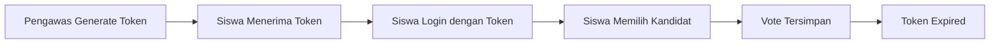

# VOON - Dokumentasi Sistem Voting Online Nasional

> **Versi**: 1.0.0  
> **Terakhir Diperbarui**: Januari 2026

---

## 📋 Daftar Isi

1. [Tentang VOON](#tentang-voon)
2. [Persyaratan Sistem](#persyaratan-sistem)
3. [Instalasi](#instalasi)
4. [Konfigurasi](#konfigurasi)
5. [Struktur Folder](#struktur-folder)
6. [Panduan Pengguna](#panduan-pengguna)
7. [Akses Demo](#akses-demo)
8. [Deployment & Hosting](#deployment--hosting)
9. [Troubleshooting](#troubleshooting)

---

## Tentang VOON

**VOON (Voting Online Nasional)** adalah sistem pemilihan digital yang dirancang khusus untuk organisasi sekolah seperti OSIS, MPK, dan ROHIS. Sistem ini mendukung:

- ✅ Multi-sekolah dengan approval admin pusat
- ✅ Multi-organisasi per sekolah
- ✅ Token voting untuk keamanan pemilihan
- ✅ Hasil realtime dengan visualisasi
- ✅ Dashboard responsif (desktop & mobile)
- ✅ Demo mode untuk testing

---

## Persyaratan Sistem

| Komponen | Versi Minimum |
|----------|---------------|
| PHP | 8.0+ |
| MySQL/MariaDB | 5.7+ / 10.4+ |
| Web Server | Apache/Nginx |
| Browser | Chrome 90+, Firefox 88+, Safari 14+ |

**Rekomendasi**: Gunakan [Laragon](https://laragon.org/) untuk development di Windows.

---

## Instalasi

### 1. Download & Extract

```bash
# Clone atau extract ke folder web server
# Contoh untuk Laragon:
C:\laragon\www\Vote-OSIS-SMKN-1-Kertajati\
```

### 2. Setup Database

**Untuk Production (kosong):**
```bash
# Import schema kosong
mysql -u root < database/voon_clean.sql
```

**Untuk Demo (dengan data contoh):**
```bash
# Import demo database
mysql -u root < database/demo_database.sql
```

### 3. Konfigurasi Environment

Edit file `config/config.php`:

```php
return [
    'app' => [
        'name' => 'VOON',
        'environment' => 'production', // atau 'demo'
        'base_path' => '/Vote-OSIS-SMKN-1-Kertajati/public',
    ],
    'database' => [
        'host' => 'localhost',
        'name' => 'voon_db',
        'user' => 'root',
        'pass' => '',
    ],
];
```

### 4. Akses Aplikasi

Buka browser dan kunjungi:
```
http://localhost/Vote-OSIS-SMKN-1-Kertajati/public/
```

---

## Konfigurasi

### File Konfigurasi Utama

| File | Fungsi |
|------|--------|
| `config/config.php` | Konfigurasi aplikasi utama |
| `config/database.php` | Konfigurasi database dual-environment |

### Environment Variables

| Variable | Deskripsi | Default |
|----------|-----------|---------|
| `APP_ENV` | production / demo | production |
| `DB_HOST` | Host database | localhost |
| `DB_NAME` | Nama database | voon_db |
| `DB_USER` | User database | root |
| `DB_PASS` | Password database | (kosong) |

---

## Struktur Folder

```
Vote-OSIS-SMKN-1-Kertajati/
├── config/                 # Konfigurasi aplikasi
│   ├── config.php
│   └── database.php
├── database/               # SQL scripts
│   ├── voon_clean.sql      # Schema production (kosong)
│   ├── demo_database.sql   # Schema + data demo
│   └── migrations/
├── public/                 # Web root (entry points)
│   ├── index.php           # Landing page
│   ├── login.php           # Halaman login
│   ├── daftar.php          # Registrasi sekolah
│   ├── vote.php            # Halaman voting
│   ├── admin.php           # Dashboard admin sekolah
│   ├── admin-pusat.php     # Dashboard admin pusat
│   ├── pengawas.php        # Dashboard pengawas
│   ├── billboard.php       # Display hasil voting
│   ├── api/                # API endpoints
│   │   ├── auth.php
│   │   ├── vote.php
│   │   └── ...
│   └── assets/             # CSS, JS, images
│       ├── css/
│       └── js/
├── src/                    # Source code PHP
│   ├── Core/               # Komponen inti
│   ├── Modules/            # Modul fitur
│   └── Services/           # Business logic
│              # Unit tests
`Ba``

---

## Panduan Pengguna

### Role & Akses

| Role | Akses | Login Via |
|------|-------|-----------|
| **Admin Pusat** | Approval sekolah, monitoring | Email & Password |
| **Admin Sekolah** | Kelola organisasi, siswa, pengawas | Email & Password |
| **Pengawas** | Generate token, monitoring voting | Username & Password |
| **Siswa/Pemilih** | Voting | Token |

### Alur Voting



### Langkah-langkah:

1. **Pengawas** login ke dashboard
2. Pilih organisasi dan siswa
3. Generate token voting
4. Berikan token ke siswa
5. **Siswa** membuka halaman voting
6. Input token
7. Pilih kandidat dan submit
8. Token otomatis expired setelah digunakan

---

## Akses Demo

Untuk testing, gunakan mode demo dengan kredensial berikut:

| Role | Email/Username | Password |
|------|----------------|----------|
| Admin Pusat | `admin@voon.id` | `password` |
| Admin Sekolah | `admin@sman1jkt.sch.id` | `password` |
| Pengawas | `spv_osis1` | `password` |
| Siswa | Token: `DEMO0001` | - |

> ⚠️ **Catatan**: Pastikan `APP_ENV` diset ke `demo` di `config/config.php`

---

## Deployment & Hosting

### Dengan Laragon + ngrok

1. **Jalankan Laragon** dan pastikan Apache/MySQL aktif
2. **Install ngrok**: Download dari [ngrok.com](https://ngrok.com)
3. **Expose localhost**:
   ```bash
   ngrok http 80
   ```
4. **Copy URL** yang diberikan ngrok (contoh: `https://abc123.ngrok.io`)
5. **Update config**:
   ```php
   'base_path' => '', // kosongkan untuk domain root
   ```

### Ke Shared Hosting

1. Upload semua file ke `public_html`
2. Pindahkan isi folder `public/` ke root
3. Update path di `config/config.php`
4. Import database via phpMyAdmin
5. Pastikan PHP 8.0+ tersedia

### Ke VPS/Cloud

```bash
# Clone repository
git clone [repo-url] /var/www/voon

# Set permissions
chown -R www-data:www-data /var/www/voon
chmod -R 755 /var/www/voon

# Configure Nginx/Apache
# Point document root ke /var/www/voon/public
```

---

## Troubleshooting

### Error: "Database Connection Failed"

✅ **Solusi**:
- Pastikan MySQL/MariaDB berjalan
- Cek kredensial di `config/config.php`
- Pastikan database sudah dibuat

### Error: "Class Not Found"

✅ **Solusi**:
- Pastikan mengakses via `public/` folder
- Cek autoloader di awal file PHP

### Error: "Session Expired"

✅ **Solusi**:
- Hapus cookies browser
- Restart session PHP
- Cek konfigurasi session di `config/config.php`

### Halaman Blank/500 Error

✅ **Solusi**:
- Cek PHP error log
- Aktifkan display_errors di php.ini (development only)
- Pastikan permission folder `uploads/` writable

---

## Kontak & Support

Untuk bantuan lebih lanjut, hubungi:
- 📧 Email: support@voon.id
- 📱 WhatsApp: [Klik untuk chat]

---

*Dokumentasi ini dibuat sebagai bagian dari rekonstruksi project Vote-OSIS SMKN 1 Kertajati.*
